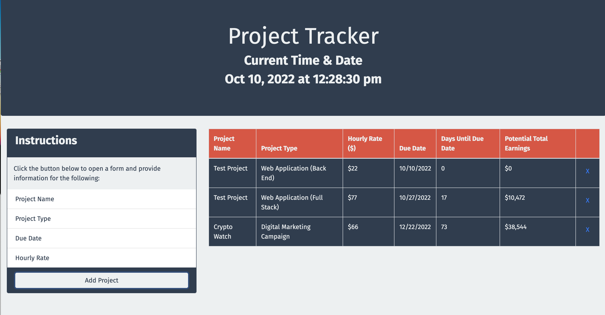
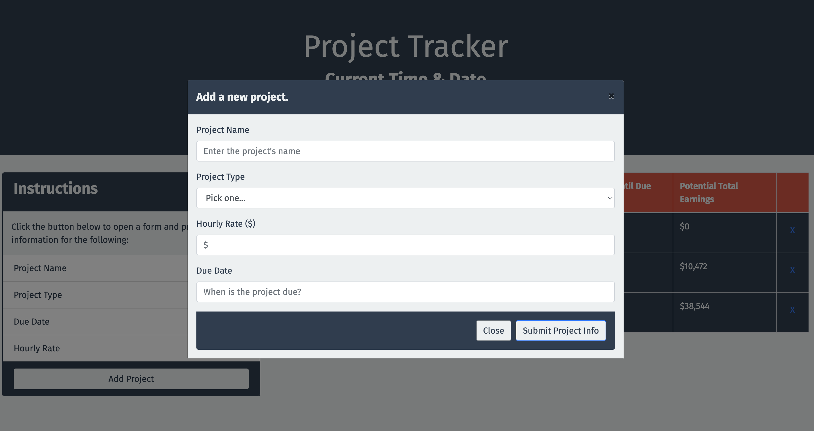

# Project Tracker

## Description

This is a simple application that allows a developer to create project items and add them to a list of projects, which are saved in local storage. The user can add items by clicking on the Add Project button, which displays a modal form, displaying the project data entry fields. The project added shows up in the Project List table. User can also delete the items by clicking on the X button in the corresponding Project List column.

---

## Usage

To visit site, navigate to the following HTTP address:

[https://mikeyboxx.github.io/project-tracker/](https://mikeyboxx.github.io/project-tracker/)

---

## Screenshot

The following images show the web application's appearance and functionality:

---

